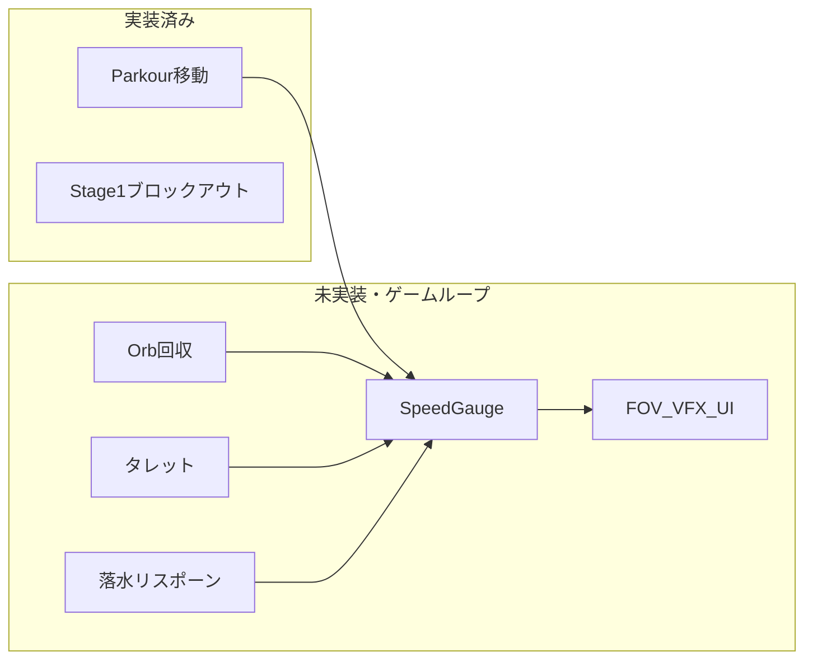

# Skyline-Dash 現状計画（確定）

対象ドキュメント:
- 現行仕様: [Assets/_md/SkylineDash_ImplementationPlan_v2.md](Assets/_md/SkylineDash_ImplementationPlan_v2.md)
- 旧仕様: [Assets/_md/Legacy/implementation_plan.md](Assets/_md/Legacy/implementation_plan.md)
- レビュー方針: [Assets/_md/ANTIGRAVITY.agent.md](Assets/_md/ANTIGRAVITY.agent.md)

今日は **2026/09/15**。完成目標は **9月下旬の試遊・投票イベント**。残り約 1.5〜2 週間。

方向は確定: リファクタや海・タレット本実装より、**SpeedGauge + Orb + 速度/FOV** でループを先に閉じる。

---

## 運用方針（確定）

実装は sou が Unity / エディタ / スクリプトで行う。

Cursor（このエージェント）は **補助AI** としてだけ動く。

やってよいこと:
- 現状コードの良い点・問題点の指摘
- Why（GC、物理フレーム、責務分離）の解説
- ヒント、疑似コード、チェックリスト
- sou が書いたコードのレビュー
- 求められたときだけ、具体的なリファクタ案（完成ファイルの丸ごと差し替えはしない）

やってはいけないこと:
- `Assets/_Scripts/`、シーン、Prefab、マテリアルなど **ゲーム資産の作成・編集・削除**
- 完成スクリプトを一度に貼って「これに置き換えて」と出すこと
- ディレクトリ再編や PlayerMotor 分離などの破壊的リファクタを勝手に進めること

例外（sou 承認済み）:
- この運用を固定する [`.cursor/rules/`](.cursor/rules/) の追加だけは、実行フェーズで Cursor が書いてよい（ゲームコードではない）

Step 1 の実装ヒントは、sou が「ゲージから始める」と明示するまで出さない。

---

## プロジェクトルール案（実行時に作成）

ファイル: `.cursor/rules/skyline-assist-only.mdc`

```yaml
---
description: Skyline-Dash は補助AI運用。ゲームコードは編集せず、ヒントとレビューのみ行う。
alwaysApply: true
---
```

内容の骨子:
- ゲームコード・シーン・Prefab を編集しない
- [Assets/_md/ANTIGRAVITY.agent.md](Assets/_md/ANTIGRAVITY.agent.md) に従う（良い点→問題点→Why→ヒント）
- 実装順はゲージ → Orb → 速度/FOV → リスポーン → タレット仮 → UI
- Legacy の武器・KillBoost・Grapple は実装しない

---

## 計画が言っていること

v2 は Legacy からゲームループを差し替えている。

- 核ループ: Orb回収＋継続走行 → スピードレベル（撃破 KillBoost ではない）
- 障害: タレット（ドローン敵ではない）
- 失敗: 落水 → 直近足場へ即復帰（速度ペナルティ）
- プレイヤー射撃・グラップルは現行仕様から外す（入力の `Attack` は名残）

コンセプトは **止まらず、食らわず、落ちず**。スピードゲージ 4 段階が核。

---

## 実装の実態

コードはパルクール原型まで。v2 ロードマップは未着手。

あるもの:
- [Assets/_Scripts/PlayerMovement.cs](Assets/_Scripts/PlayerMovement.cs)、WallRunning、Sliding、Climbing（Stage1 では Climbing 無効）
- Stage1 は Cinemachine（`PlayerCam` は無効）
- [Assets/_Scenes/Stage1.unity](Assets/_Scenes/Stage1.unity) の ProBuilder ブロックアウト
- Input System、URP、Unity 6000.4.1f1

ないもの: `SpeedGaugeController`、Orb、タレット、リスポーン、ゲージ UI、速度 VFX/SFX、プール、水面

ビルドシーンはまだ `SampleScene`。本番は `Stage1`。



---

## 試遊までに残す / 削る

**Must**
1. `SpeedGaugeController` + `SpeedLevelDefinition`（SO）
2. `OrbPickup` と Stage1 仮配置
3. ゲージ → `PlayerMovement` 速度倍率 + Cinemachine FOV
4. 落下リスポーン（今は Y 境界 or KillTrigger。水面は後）
5. ビルドシーンを `Stage1` にする

**Should**
6. タレットは視線警告 + ヒット判定から。弾プールは後
7. ゲージ UI（Fill Image 1 枚）
8. 既存 Platform をつないで一本道にする

**Cut / Later**
- PlayerMotor / PlayerInputHandler 分離、ディレクトリ大移動
- 本格プール、Shader Graph 海、スピードライン本実装
- グラップル、武器、KillBoost
- レベルダウン遅延などの体感調整はループ成立後

速度の現状は固定値（walk 4 / sprint 6 / slide 8）。Lv は `_moveSpeed` 群への倍率で足す。

Orb 大量配置では Inspector の UnityEvent 直結は破綻しやすい。ゲージ加算はコード参照、またはハブ 1 箇所。

---

## 実装順（sou が書く単位）

1. ゲージ基盤（レベル閾値、イベント）
2. Orb → ゲージ加算、Stage1 に並べて導線確認
3. 移動速度・FOV をレベルに接続
4. 落下復帰 + ゲージ減
5. タレット仮
6. UI → 音/VFX は残時間次第

1 システムずつ PlayMode で確認する。一気にアーキテクチャは触らない。

---

## 次のアクション

1. この計画の承認後、Cursor が `.cursor/rules/skyline-assist-only.mdc` だけ追加する
2. sou が「ゲージから始める」と言ったら、完成コードではなくヒントから Step 1 を開始する
